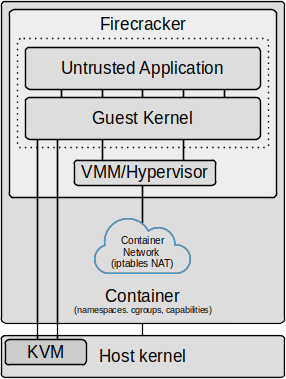

# launcher
The launcher is really the core component of firecracker-in-docker and serves as either a *template* Dockerfile and launch script for when the [image-builder](../image-builder) has been configured to create *standalone* Dockerfiles, or as the base image when the [image-builder](../image-builder) has been configured to create *derived* Dockerfiles.

## Usage
As a prerequisite, the firecracker-in-docker launcher requires an appropriately configured Linux kernel to be compiled and copied to [kernel/vmlinux](kernel/vmlinux). The best way to obtain a kernel is to follow the instructions in the [kernel-builder](../kernel-builder) section of this repository.

Once a kernel has been built and copied to [kernel/vmlinux](kernel/vmlinux), to build the firecracker-in-docker base image run:
```
docker build -t firecracker-in-docker .
```
Another prerequisite is for a root filesystem to be built and copied to [rootfs/rootfs.ext4](rootfs/rootfs.ext4). The most straightforward way to create the required root filesystem is to use the [image-builder](../image-builder), which will create a copy of this launcher directory, generate the root filesystem from the specified source Docker image, and generate a modified Dockerfile in the copy of the launcher directory that has been created for the new image.

The [examples](../examples) directory illustrates the whole process of using [image-builder](../image-builder) to generate new firecracker-in-docker images for a few representative sample Docker images.

Where a suitable root filesystem already exists, an alternative to using image-builder is simply to copy the root filesystem to [rootfs/rootfs.ext4](rootfs/rootfs.ext4) then bind-mount rootfs/rootfs.ext4 into our firecracker-in-docker container:
```
-v $PWD/rootfs/rootfs.ext4:/usr/local/bin/rootfs.ext4
```
In general though, the best way to run firecracker-in-docker is to use the [image-builder](../image-builder), which will create a directory with a Dockerfile, launch script, kernel and root filesystem and this launcher directory is really just a template for that, however bind-mounting a root filesystem can be a useful way to quickly try new filesystems using the base firecracker-in-docker image.
### Running the container
#### Run time container settings
A firecracker-in-docker container is really just a regular Docker container, however some specific settings are required so the following example [firecracker](firecracker) launch script serves as a useful starting point.
```
docker run --rm -it \
  --cap-drop all \
  --cap-add NET_RAW \
  --cap-add NET_ADMIN \
  --group-add $(cut -d: -f3 < <(getent group kvm)) \
  --device=/dev/kvm \
  --device /dev/net/tun \
  -u $(id -u):$(id -g) \
  -v $PWD/rootfs/rootfs.ext4:/usr/local/bin/rootfs.ext4 \
  firecracker-in-docker
```
We could have simply used `--cap-add NET_ADMIN` above, as NET_RAW is included in the Docker [default list of capabilities](https://docs.docker.com/engine/reference/run/#runtime-privilege-and-linux-capabilities), but in general it is better to first drop all capabilities then selectively add only those that are *actually* required to run an application. These capabilities are needed to run ip and iptables, used to set up the network between the container and Firecracker.

Ideally we would like to start our containers with the  `--security-opt no-new-privileges` [security configuration](https://docs.docker.com/engine/reference/run/#security-configuration), which prevents container processes from gaining new privileges. Unfortunately, however, that's not an option with firecracker-in-docker because we use copies of ip and iptables that have [additional capabilities set](https://www.kernel.org/doc/html/latest/userspace-api/no_new_privs.html) and the no-new-privileges flag blocks file capabilities.

Firecracker relies on hardware virtualisation, so our container needs access to the /dev/kvm device:
```
--device=/dev/kvm
```
in addition to adding the /dev/kvm device, the container process needs to be a member of the kvm group, which may be added as one of its supplementary groups.
```
--group-add $(cut -d: -f3 < <(getent group kvm))
```
The subshell command above is simply a way to obtain the host's kvm group ID number and if we already know that we could simply use that instead, e.g.
```
--group-add 108
```
Firecracker emulated network devices are backed by [TAP devices on the host](https://github.com/firecracker-microvm/firecracker/blob/main/docs/design.md#host-networking-integration), so our container needs access to the /dev/tun device.
```
--device /dev/net/tun
```
In order to run as an unpriviliged user we set:
```
-u $(id -u):$(id -g)
```
which sets the user and group ID of the container process to those of the user running the command, however we can use any arbitrary non-root user ID.

In this example we bind-mount rootfs/rootfs.ext4 into our firecracker-in-docker container:
```
-v $PWD/rootfs/rootfs.ext4:/usr/local/bin/rootfs.ext4
```
In general the best way to run firecracker-in-docker is to use the [image-builder](../image-builder), which will create a directory with a Dockerfile, launch script, kernel and root filesystem and this launcher directory is really just a template for that, however bind-mounting a root filesystem can be a useful way to quickly try new filesystems using the base firecracker-in-docker image.

#### Environment variables
The following configuration environment variables are currently supported:

- FC_KERNEL_LOGLEVEL: Set the guest kernel `loglevel=` [boot parameter](https://www.kernel.org/doc/html/latest/admin-guide/kernel-parameters.html) value. The range is from 0 (KERN_EMERG) to 7 (KERN_DEBUG) and the default value is 0, which essentially disables the kernel logs.
- FC_KERNEL_BOOTARGS: Set or override guest kernel boot parameter values. This allows advanced users to specify specific values e.g. using -e FC_KERNEL_BOOTARGS="8250.nr_uarts=0" could improve boot time at the expense of disabling the serial console (which may lead to unexpected behaviour). Your mileage may vary  with the FC_KERNEL_BOOTARGS option and the defaults seem OK.
- FC_EPHEMERAL_STORAGE: Configures the root filesystem size. If unset the default is to resize the root filesystem to double its minimised size. If it is set to a value greater than zero then the root filesystem will be resized to the specified size, as interpreted by [resize2fs](https://man7.org/linux/man-pages/man8/resize2fs.8.html). If set to zero  then the root filesystem will not be resized.
- FC_VCPU_COUNT: Set the vcpu_count (ignored if `--cpus=` is used).
- FC_MEM_SIZE: Set the mem_size_mib (ignored if `--memory=` is used).
- FC_HT_ENABLED: Enable hyperthreading. Disabled by default, which seems to be the case for most Firecracker examples.
- FC_UID: Set the UID of the Firecracker user. The default is a pseudorandom value between 1000 and 33767. Setting this to 0 keeps the guest running as root. In general it's better to run as an unprivileged user, but some images need to be run as root and also it's a useful debugging option.

## Implementation Details
### Overview
A firecracker-in-docker container is really just a regular Docker container that may be run in exactly the same way as any other Docker container, that is to say it has no dependencies on any particular container runtime.

The conceptual architecture of a firecracker-in-docker container is illustrated below:

 

In simple terms, at startup the container launches the Firecracker MicroVM using the kernel and root filesystem built into the container image and establishes a NAT inside the container's network namespace from the container's network interface to the VM's IP.

### Dockerfile
The firecracker-in-docker [Dockerfile](Dockerfile) is actually relatively simple, beginning with some of the usual boilerplate:
```
FROM ubuntu:20.04

ARG FC_VERSION=v0.25.2
```
 though it has a few interesting details that merit some explanation.

#### COPY kernel and root filesystem into the image
The first step is to COPY the kernel (kernel/vmlinux) into the image, which requires that a kernel has previously been built (e.g. using [kernel-builder](../kernel-builder)) and placed into the [kernel](kernel) subdirectory of launcher:
```
COPY kernel/vmlinux /usr/local/bin/vmlinux
```
For Dockerfiles that have been generated by the [image-builder](../image-builder) configured to create *standalone* Dockerfiles, which will use this Dockerfile as a template, there will be an additional COPY:
```
COPY rootfs/rootfs.ext4 /usr/local/bin/rootfs.ext4
```
We don't do this in the template Dockerfile here, as we want the option either to use it to create a base image *or* to serve as a template and we don't really want a root filesystem in the base image that will simply be overwritten in derived images.

#### Install the required packages
The next step is to install the required packages:
```
RUN apt-get update && DEBIAN_FRONTEND=noninteractive \
    apt-get install -y --no-install-recommends \
    e2tools curl ca-certificates iproute2 iptables
```
The curl and ca-certificates packages are only required for downloading and installing the Firecracker binary and are purged at the end of the Dockerfile.

The iproute2 and iptables packages install the `ip` and `iptables` executables respectively, which are necessary to establish the network route between the container's network interface and the guest VM's IP.

The [e2tools](https://github.com/e2tools/e2tools) package is possibly the most interesting one. It comprises a set of utilities to read, write, and manipulate files in an ext2/ext3/ext4 filesystem. These utilities access a filesystem directly using the ext2fs library and may be used to read or write filesystem images **without having to mount them or otherwise require elevated privileges**. We use e2cp to "inject" env vars, configuration, etc., into the root filesystem at startup before booting Firecracker and we use e2ls to determine if our custom /sbin/init-entrypoint is present in the root filesystem.

#### Set the required file capabilities
To set up networking from the container to the Firecracker MicroVM we need to establish a tap device in the container, then create a NAT or bridge between the container's eth0 interface and the guest VM's IP.

To create the tap device we need the [capability](https://man7.org/linux/man-pages/man7/capabilities.7.html) CAP_NET_ADMIN and to establish the nat routing we need CAP_NET_ADMIN and CAP_NET_RAW. By default the `ip` and `iptables` commands used to set up the networking must be run as root (uid 0), however we wish to run firecracker-in-docker with as few privileges as possible, and as an arbitrary non-root user. To do this we create a copy of ip and iptables and use [setcap](https://man7.org/linux/man-pages/man8/setcap.8.html) to add the required file capabilities to the copies as follows:
```
cp /usr/bin/ip /usr/local/bin/ip
setcap cap_net_admin=eip /usr/local/bin/ip
cp /usr/sbin/iptables /usr/local/bin/iptables
setcap cap_net_admin,cap_net_raw=eip /usr/local/bin/iptables
```
Setting file capabilities in this way avoids us having to unnecessarily run the container as uid 0, or make the required executables setuid, however there is an additional issue with iptables.

In addition to needing the CAP_NET_ADMIN and CAP_NET_RAW capabilities to run, if run as a non-root user iptables fails with the error:
```
Fatal: can't open lock file /run/xtables.lock: Permission denied
```
To resolve this, we create the lock file with mode 0666 as described in [this](https://patchwork.ozlabs.org/project/netdev/patch/2ef2150d-7149-cf39-0ea8-78edfc2c8d92@virtuozzo.com/) iptables commit.
```
touch /run/xtables.lock && chmod 666 /run/xtables.lock
```
That doesn't reduce security, as it's only a lockfile, and indeed upstream iptables has made the location configurable via the XTABLES_LOCKFILE environment variable for exactly the scenario where the user has granted enough capabilities but lacks access to the XT_LOCK_NAME, as described in [this](https://git.netfilter.org/iptables/commit/?id=5105e844c2ff6a3e320bf8cdadc5094d4eaef2b7) commit. Unfortunately, however, iptables from ubuntu:20.04 doesn't yet support the XTABLES_LOCKFILE environment variable.

#### Install the Firecracker binary
After configuring the executables required for network setup, we fetch the required Firecracker release and install it in /usr/local/bin:
```
curl -sSL https://github.com/firecracker-microvm/firecracker/releases/download/${FC_VERSION}/firecracker-${FC_VERSION}-x86_64.tgz | tar -xzv -C /usr/local/bin
cd /usr/local/bin
mv release-${FC_VERSION}-x86_64/firecracker-${FC_VERSION}-x86_64 firecracker
rm -rf release-${FC_VERSION}
```

#### Tidy up the image
Finally, we tidy up after ourselves:
```
apt-get clean
apt-get purge -y curl ca-certificates
apt-get autoremove -y
rm -rf /var/lib/apt/lists/*
```
#### Set the ENTRYPOINT
then set the container's ENTRYPOINT to our firestarter startup script:
```
ENTRYPOINT ["/usr/local/bin/firestarter"]
```
#### Build the image
To build the firecracker-in-docker image run:
```
docker build -t firecracker-in-docker .
```
&nbsp;
### firestarter
The [firestarter](resources/firestarter) script is probably the most important part of firecracker-in-docker; its role is to configure the root filesystem, configure the networking and then actually launch Firecracker.

Much of firestarter is really just automating the processes described in the firecracker [network setup](https://github.com/firecracker-microvm/firecracker/blob/main/docs/network-setup.md#on-the-host) and [getting started](https://github.com/firecracker-microvm/firecracker/blob/main/docs/getting-started.md#configuring-the-microvm-without-sending-api-requests) documentation, plus information gleaned from the Linux kernel [boot parameters](https://www.kernel.org/doc/html/latest/admin-guide/kernel-parameters.html) documentation. There are a number of nuances however, so it is worth covering in some detail.

#### Check IPV4 forwarding is enabled
The first thing firestarter does is to check that IPV4 forwarding is enabled in the container, as this is a prerequisite for establishing the networking between the container and the VM:
```
if [[ $(< /proc/sys/net/ipv4/ip_forward) != "1" ]]; then
  echo "WARNING: IPv4 forwarding is disabled. Networking will not work."
  exit 1
fi
```
In most cases /proc/sys/net/ipv4/ip_forward should already be 1 by this point, because we are running in a container and Docker uses IPv4 forwarding itself.

If this isn't set, restarting Docker on the host should fix things, e.g.:
```
sudo service restart docker
```
or
```
sudo systemctl restart docker
```
IPV4 forwarding can also be set by running:
```
sudo sysctl -w net.ipv4.conf.all.forwarding=1
```
#### Set kernel and root filesystem paths
Once firestarter has established that IPv4 forwarding is enabled, it next sets the paths to the kernel and root filesystem that will be used later in the Firecracker configuration.
```
KERNEL_IMAGE_PATH="/usr/local/bin/vmlinux"
ROOTFS="/usr/local/bin/rootfs.ext4"
```
#### Resize the root filesystem
The firecracker-in-docker images created by [image-builder](../image-builder) are built with the root filesystem deliberately shrunk to contain only those blocks that are actually used. This step will grow it again to a configurable (or default) larger size that in essence creates some (ephemeral) writable space analogous to a regular container's writable layer.

We first run e2fsck with -y to non-interactively fix any issues with the root filesystem. The `&& true` prevents any non zero error code causing the script to terminate and we redirect both stdout and stderr to /dev/null.
```
e2fsck -y $ROOTFS &>/dev/null && true
```

We next resize the root filesystem based on the value of the FC_EPHEMERAL_STORAGE environment variable.

If FC_EPHEMERAL_STORAGE is unset, the default is to resize the root filesystem to double its minimised size. If it is set to a value greater than zero then the root filesystem will be resized to the specified size, as interpreted by [resize2fs](https://man7.org/linux/man-pages/man8/resize2fs.8.html). If no units are specified, the units of the size parameter shall be the file system blocksize of the file system. Optionally, the size parameter may be suffixed by one of the following units designators: 'K', 'M', 'G', 'T' (either upper-case or lower-case) or 's' for power-of-two kilobytes, megabytes, gigabytes, terabytes or 512 byte sectors respectively. If set to zero  then the root filesystem will not be resized.
```
if [ -z ${FC_EPHEMERAL_STORAGE+x} ]; then
  FSCK_RESULTS=($(e2fsck -n $ROOTFS 2> /dev/null))
  # The output of e2fsck will be of the form:
  # rootfs.ext4: clean, 29955/74240 files, 260774/296704 blocks
  # so we parse into an array and blocks will be the 4th entry.
  USED_BLOCKS=$(echo ${FSCK_RESULTS[4]} | cut -d"/" -f1)
  USED_BLOCKS=$((USED_BLOCKS*2))

  # Grow the root filesystem to its new size.
  resize2fs $ROOTFS $USED_BLOCKS &>/dev/null && true
elif [[ $FC_EPHEMERAL_STORAGE != "0" ]]; then
  # Grow the root filesystem to its new size.
  resize2fs -f $ROOTFS $FC_EPHEMERAL_STORAGE &>/dev/null && true
fi
```
#### Set initial kernel boot parameters
firestarter next sets the initial kernel [boot parameters](https://www.kernel.org/doc/html/latest/admin-guide/kernel-parameters.html) (which will be added to later when we configure the network):
```
FC_KERNEL_LOGLEVEL="${FC_KERNEL_LOGLEVEL:-0}"
FC_KERNEL_BOOTARGS="${FC_KERNEL_BOOTARGS:-}"
BOOT_ARGS="ro noapic console=ttyS0 reboot=k panic=1 pci=off random.trust_cpu=on i8042.noaux i8042.nomux i8042.nopnp i8042.dumbkbd tsc=reliable ipv6.disable=1 loglevel=${FC_KERNEL_LOGLEVEL}"
```
It is worth covering the reasoning behind some of those boot parameters:

The `console=ttyS0` option configures the kernel to use the serial console, which is needed to see the VM's stdout, and also if systemd is used in a guest it will hang for 90s on start up if a console is not available.

The `noapic reboot=k panic=1 pci=off`options should be fairly obvious, because Firecracker has no PCI bus and a simple ctrl-alt-del reboot handler and we don't need the IOAPIC and want to wait one second before rebooting on panic.

The `random.trust_cpu=on` option is more interesting. The reason for this is because the entropy available with the Firecracker MicroVM is pretty low, as may be seen by running the following command on the guest using the default boot parameters:
```
cat /proc/sys/kernel/random/entropy_avail
```
Low entropy causes issues (hangs due to blocking API calls) with applications that require entropy e.g. Python (as described in https://lwn.net/Articles/693189/) and https://bugs.python.org/issue25420). There is a discussion on the topic in firecracker-microvm [issue 663](https://github.com/firecracker-microvm/firecracker/issues/663) and firecracker-containerd [issue 325](https://github.com/firecracker-microvm/firecracker-containerd/issues/325).

One option to mitigate this is the `random.trust_cpu=on` option (or add RANDOM_TRUST_CPU to the kernel config when compiling). Note however that this is only available for kernels > v4.19, so the stock v4.14.174 kernel referenced in the Firecracker quick start will not benefit and can cause issues for Python applications using that kernel in Firecracker.

Note that trusting the hardware RNG can be a [controversial topic](https://lwn.net/Articles/760584/), but the option gives a choice whether trusting RDRAND is worth it to avoid hangs due to userspace trying to get cryptographic-grade entropy early in the boot process.

Another option, where trusting the hardware RNG is problematic, may be "[sneakernet](https://www.av8n.com/computer/htm/secure-random.htm#sec-sneakernet)". The gist is to copy randomness from the host:
```
dd if=/dev/urandom of=/thumb/random.seed bs=512 count=2
```
and inject them onto the guest:
```
cat /path/to/random.seed > /dev/urandom
```
This is not currently done in firecracker-in-docker, but could be done in a similar way to how we inject env vars into /sbin/init-entrypoint later, where we could create a seed file in the container and copy that to the rootfs and cat that to /dev/urandom as part of the init.

The `i8042` options disable probing for the device, as documented in the firecracker [API request documentation](https://github.com/firecracker-microvm/firecracker/blob/main/docs/api_requests/actions.md#intel-and-amd-only-sendctrlaltdel). Note that disabling probing prevents log messages that aren't dropped by setting loglevel=0, but the device is still active and SendCtrlAltDel still works (if Firecracker is started with --api-sock /tmp/firecracker.socket).

The `tsc=reliable` option disables clocksource verification at runtime as well as the stability checks done at bootup. This id used to enable high-resolution timer mode on older hardware, and in virtualised environments.

The `ipv6.disable=1` option is because we're routing internally using ipv4, so we may as well reduce boot time and available guest kernel surface.

#### Initialise the Guest UID
By default the last thing we do when initing Firecracker is to `exec chpst`, to replace init with the application ENTRYPOINT running as an unprivileged user with a pseudorandom UID. If instead we set FC_UID=0 this behaviour will be overridded and init will directly exec the application ENTRYPOINT, which will then run as root in the Firecracker guest. In general it's better to run the application as an unprivileged user, but some images need to be run as root and also it's a useful debugging option.
```
FC_UID="${FC_UID:-$(($RANDOM + 1000))}"
```

#### Infer environment variables
Before starting Firecracker, firestarter attempts to "infer" any environment variables that may have been added at run-time via Docker's `-e` or `--env` options by comparing against a list of "standard" variables.

Note that this approach will fail if an application actually happens to *want* to pass any of the ignored values. This edge case is catered for by escaping the required environment variable with underscores, for example to set PATH in the guest use `-e __PATH__="some value"`. If an application requires a double underscored variable then it should be escaped by double underscores e.g. for `__KEY__` use `-e  ____KEY____="value"`. Any environment variables prefixed by FC_ are reserved for configuring firecracker-in-docker.

The parsing approach that is used below is based on the stackoverflow post https://stackoverflow.com/questions/56633343/print-all-environment-variables-but-skipping-multiline-variables.
```
CONTAINER_ENV_VARS="export \"UID=$FC_UID\"\n"
while read -r -d '' line; do
  [[ ! $line =~ ^(HOSTNAME|PWD|HOME|TERM|SHLVL|PATH|OLDPWD|_|FC_.*)= ]] && CONTAINER_ENV_VARS=${CONTAINER_ENV_VARS}$(echo "export \"$(echo $line | sed -e 's/__\(.*\)__/\1/g')\"")"\n"
done < <(env -0)
```
We next write the inferred environment variables to a file in /etc/profile.d in the guest root filesystem, to be read by the guest init process when Firecracker boots.

We use `e2cp` from the [e2tools](https://github.com/e2tools/e2tools) package to write the environment variables file, so that we can modify the Firecracker root filesystem without needing mount.
```
echo -e "$CONTAINER_ENV_VARS" | e2cp -O 0 -G 0 -P 644 - ${ROOTFS}:/etc/profile.d/01-container-env-vars.sh
```

#### Set the VM VCPU and memory limits
The Firecracker process launched by firecracker-in-docker respects the CPU and memory cgroup limits that may be applied via Docker's `--cpus=` and `--memory=` options, however we need values for vcpu_count and mem_size_mib for the machine-config section of vmconfig when we come to start Firecracker.

Firecracker can [overcommit VCPU and memory](https://github.com/firecracker-microvm/firecracker/blob/main/docs/design.md#features), so in theory one could start all instances with more resources specified than actually required, but that means creating more VCPU threads than necessary or mapping more memory. To avoid that we infer an approprate FC_VCPU_COUNT and FC_MEM_SIZE from any container limits that have been specified, or if container limits have not been set use those environment variables or, finally, fall back to default values of 2xVCPU and 2048MiB memory.

TODO investigate the memory balloon device, which can be used to reclaim and give back guest memory (requires guest kernel support)
https://github.com/firecracker-microvm/firecracker/blob/main/docs/ballooning.md.

Note that The `--cpus=` value is a convenience setting and is actually `cfs_quota_us`/`cfs_period_us` as described in the Docker [CFS scheduler configuration](https://docs.docker.com/config/containers/resource_constraints/#configure-the-default-cfs-scheduler) documentation. The calculation below rounds up the result of integer division of those values using the approach described in: https://stackoverflow.com/questions/2395284/round-a-divided-number-in-bash/24253318#24253318
```
if [ -f /sys/fs/cgroup/memory/memory.limit_in_bytes ]; then
  limit_in_bytes=$(cat /sys/fs/cgroup/memory/memory.limit_in_bytes)
  if [ $limit_in_bytes != "9223372036854771712" ]; then
    FC_MEM_SIZE=$(( $limit_in_bytes/1048576 ))
  fi
fi
FC_MEM_SIZE="${FC_MEM_SIZE:-2048}" # Default mem_size_mib 2048

if [ -f /sys/fs/cgroup/cpu/cpu.cfs_quota_us ]; then
  cfs_quota_us=$(cat /sys/fs/cgroup/cpu/cpu.cfs_quota_us)
  cfs_period_us=$(cat /sys/fs/cgroup/cpu/cpu.cfs_period_us)
  if [ $cfs_quota_us != "-1" ]; then
    FC_VCPU_COUNT=$(( ($cfs_quota_us + $cfs_period_us - 1)/$cfs_period_us ))
  fi
fi
FC_VCPU_COUNT="${FC_VCPU_COUNT:-2}" # Default vcpu_count is 2

# Set FC_HT_ENABLED false if not set else convert to lowercase
FC_HT_ENABLED="${FC_HT_ENABLED:-false}" # Default is false
FC_HT_ENABLED=$(echo $FC_HT_ENABLED | tr '[:upper:]' '[:lower:]')
```

#### Configure guest init
If the Firecracker root filesystem has been populated with the /sbin/init-entrypoint generated by [image-builder](../image-builder) then we update the Firecracker kernel `init=` boot argument to use that. We use `e2ls` from the [e2tools](https://github.com/e2tools/e2tools) package  to directly check the Firecracker root filesystem without needing mount.

Unfortunately it's not as simple as just doing the obvious `e2ls $ROOTFS:/sbin/init-entrypoint`, however, because many modern Linux distros (e.g. Ubuntu 20.04) are migrating to place all executables in say /usr/bin and symlinking to there. Unfortunately `e2ls` doesn't follow symlinks, so we explicitly check the most likely paths in order of likelihood and guard for failures.
```
INIT_PATH="/sbin/"
ENTRYPOINT=$(e2ls ${ROOTFS}:/sbin/init-entrypoint 2> /dev/null || true)
[ -z "$ENTRYPOINT" ] && INIT_PATH="/usr/sbin/"
ENTRYPOINT=${ENTRYPOINT:-$(e2ls ${ROOTFS}:/usr/sbin/init-entrypoint 2> /dev/null || true)}
[ -z "$ENTRYPOINT" ] && INIT_PATH="/usr/bin/"
ENTRYPOINT=${ENTRYPOINT:-$(e2ls ${ROOTFS}:/usr/bin/init-entrypoint 2> /dev/null || true)}
```
If /sbin/init-entrypoint is present then firestarter will configure the guest init to use that, however dealing with any command line arguments adds an additional complication.

Passing arguments to the guest init turns out to be quite a convoluted process. In an ideal world it *should* be relatively simple, because according to the kernel [boot parameters](https://www.kernel.org/doc/html/latest/admin-guide/kernel-parameters.html) documentation "everything after “--” is passed as an argument to init." .

However, one complication is that there was a [bug](https://github.com/firecracker-microvm/firecracker/issues/2709) in Firecracker, whereby it appends arguments like `root=` and `virtio_mmio.device=` **after** any user supplied arguments.  This issue has been [resolved](https://github.com/firecracker-microvm/firecracker/pull/2716) in the Firecracker [v0.25.2](https://github.com/firecracker-microvm/firecracker/releases/tag/v0.25.2) release, however, even with that fix there is still an issue with respect to escaping double quotes in command lines like: `-c 'echo "hello world"'`. Unfortunately a command line like this actually gets sent to init as: `-c 'echo hello world"'`, e.g. without the double quote before the h in hello.

This problem actually seems to be a kernel bug, so for now we package any arguments passed to the container's command line into an environment variable (passed to the guest root filesystem in the same way as our inferred environment variables) and have /sbin/init-entrypoint use that to add to the argument list.
```
if [ ! -z "$ENTRYPOINT" ]; then
  BOOT_ARGS="${BOOT_ARGS} init=/sbin/init-entrypoint"

  if [ $# -ne 0 ]; then
    INIT_ARGS=""
    for i in "$@"; do INIT_ARGS="${INIT_ARGS}'$i' "; done
    INIT_ARGS=$(echo $INIT_ARGS | sed 's/\"/\\\"/g')
    #echo "$INIT_ARGS"

    CONTAINER_ENV_VARS=${CONTAINER_ENV_VARS}$(echo "export \"INIT_ARGS=$INIT_ARGS\"")"\n"
    echo -e "$CONTAINER_ENV_VARS" | e2cp -O 0 -G 0 -P 644 - ${ROOTFS}:/etc/profile.d/01-container-env-vars.sh
  fi
fi
```
#### Configure the network
To configure the network the first thing we do is to copy the container's hostname, appended with "-firecracker", to the Firecracker guest root filesystem, then copy the container's /etc/resolv.conf to the guest rootfs to configure the guest DNS. We again use `e2cp` from the [e2tools](https://github.com/e2tools/e2tools) package so we can modify the Firecracker rootfs without needing mount.
```
echo "$(cat /etc/hostname)-firecracker" | e2cp -O 0 -G 0 - ${ROOTFS}:/etc/hostname
e2cp -p /etc/resolv.conf ${ROOTFS}:/etc/resolv.conf
```
We next initialise a number of variables that we will use later.
```
INTERFACE=eth0
TAP_DEVICE_NAME="tap0"

GUEST_IP=172.16.0.2 # Comment this out to use random values
GUEST_IP="${GUEST_IP:-$(echo 172.$((RANDOM%(31-16+1)+16)).$((RANDOM%256)).$((RANDOM%(254-2+1)+2)))}"
PREFIX=$(echo $GUEST_IP | cut -f1,2,3 -d\.)
GATEWAY_IP="${GATEWAY_IP:-$(echo ${PREFIX}.1)}"

GUEST_MAC="FE:05$(for i in {1..8}; do printf '%X' $(($RANDOM % 16)); done | sed -e 's/\(..\)/:\1/g')"
```

then update the Firecracker kernel boot arguments with our guest IP and gateway IP configuration:
```
BOOT_ARGS="${BOOT_ARGS} ip=${GUEST_IP}::${GATEWAY_IP}:255.255.255.0::eth0:off"
```
To actually set up the networking between the parent container and the Firecracker VM we (mostly) follow the same pattern described in the Firecracker [network-setup](https://github.com/firecracker-microvm/firecracker/blob/main/docs/network-setup.md#on-the-host) documentation:
```
ip tuntap add mode tap $TAP_DEVICE_NAME

ip addr add $GATEWAY_IP/24 dev $TAP_DEVICE_NAME
ip link set dev $TAP_DEVICE_NAME up

iptables -A POSTROUTING -t nat -o $INTERFACE -j MASQUERADE
iptables -A FORWARD -m conntrack --ctstate RELATED,ESTABLISHED -j ACCEPT
iptables -A FORWARD -i $TAP_DEVICE_NAME -o $INTERFACE -j ACCEPT
```
One subtle difference is that here we are using our modified ip and iptables commands, which have CAP_NET_ADMIN and CAP_NET_RAW file capabilities added, so that we don't have to run them as root. Moreover, those commands are operating inside our container's network namespace, so will have no impact on any host networking.

In addition to configuring NAT networking from the MicroVM's tap device to the container's eth0 interface as described in the Firecracker documentation, we also set up port forwarding from the container to Firecracker. This [command](https://www.adamintech.com/how-to-use-iptables-for-port-forwarding/) [forwards](https://jensd.be/343/linux/forward-a-tcp-port-to-another-ip-or-port-using-nat-with-iptables) everything on the container's eth0 interface to the MicroVM's IP.
```
iptables -A PREROUTING -t nat -i $INTERFACE -j DNAT --to-destination $GUEST_IP
```
#### Start Firecracker
After all of the setup has been done actually starting Firecracker is very simple. One option is to use Firecracker's REST API, but firecracker-in-docker instead generates a vmconfig.json file:
```
cat <<EOF > /tmp/vmconfig.json
{
    "boot-source": {
        "kernel_image_path": "$KERNEL_IMAGE_PATH",
        "boot_args": "$BOOT_ARGS $FC_KERNEL_BOOTARGS"
    },
    "drives": [
        {
            "drive_id": "rootfs",
            "path_on_host": "$ROOTFS",
            "is_root_device": true,
            "is_read_only": false
        }
    ],
    "network-interfaces": [
        {
            "iface_id": "eth0",
            "guest_mac": "$GUEST_MAC",
            "host_dev_name": "$TAP_DEVICE_NAME"
        }
    ],
    "machine-config": {
        "vcpu_count": $FC_VCPU_COUNT,
        "mem_size_mib": $FC_MEM_SIZE,
        "ht_enabled": $FC_HT_ENABLED
    }
}
EOF
```
Firecracker is then started using the generated vmconfig.json. We use `env -i` to start Firecracker in order to cleanup all environment variables prior to launching and we use `exec` to replace firestarter with /usr/local/bin/firecracker, which will then be run as the container's PID 1.
```
exec env -i /usr/local/bin/firecracker --no-api --config-file /tmp/vmconfig.json
```
&nbsp;
### What about the Firecracker Jailer?
The Firecracker documentation recommends using [Jailer](https://github.com/firecracker-microvm/firecracker/blob/main/docs/jailer.md) in a production Firecracker deployment.

It is worth understanding what Jailer is *actually* doing, however, to understand why firecracker-in-docker can run just as securely without using Jailer.

From the [documentation](https://github.com/firecracker-microvm/firecracker/blob/main/docs/jailer.md#jailer-operation) some of the key things that Jailer does includes:

- Cleanup environment variables.
- Create chroot and unshare + pivot root into new mount namespace.
- Set resource (rlimit) and cgroup limits.
- Join specified network namespace (if configured to do so).
- Run Firecracker in new PID namespace (if configured to do so).
- Run Firecracker as unprivileged uid and gid.

By launching Firecracker from a container, however, all of those protections (and more) are *already* in place by default, so using Jailer actually adds no additional protection in this case.

This topic was discussed in [a recent conversation](https://github.com/firecracker-microvm/firecracker/issues/2785) with the Firecracker developers, who agreed that the messaging with respect to Jailer should be changed to:
>Firecracker is designed with two layers of isolation: the Linux KVM + Firecracker virtualization boundary, and the container-like Linux layer (isolated mount, pid, network, etc. namespaces, cgroups, seccomp, etc.); the latter can be readily provided by the jailer binary that's part of each Firecracker release, or by equivalent technology deployed by Firecracker users. In production, Firecracker should not be run without this second layer of isolation.

It's worth noting that it is actually *possible* to run Jailer in a container, but to do so one has to actively **reduce** the container's security, by providing elevated privileges. To run Jailer, a container needs to be run with the following capabilities:
```
CAP_SYS_ADMIN, CAP_CHOWN, CAP_DAC_OVERRIDE, CAP_MKNOD, CAP_SETGID, CAP_SETUID, CAP_SYS_CHROOT
```
To run the jailer binary as a non-root user it needs those capabilities set as file capabilities as follows:
```
setcap cap_chown,cap_dac_override,cap_mknod,cap_setgid,cap_setuid,cap_sys_admin,cap_sys_chroot=eip jailer
```
In addition to requiring a large set of highly privileged capabilities, a custom seccomp profile is required to add `pivot_root `to the container's seccomp allow list (CAP_SYS_ADMIN ungates unshare, but that capability is already very privileged). A custom AppArmor profile is also required to enable mount and umount, among other things.

On balance, therefore, it does not seem sensible to increase the privileges of the container just to run Jailer, when the container itself provides at least the same level of additional isolation a Jailer.
